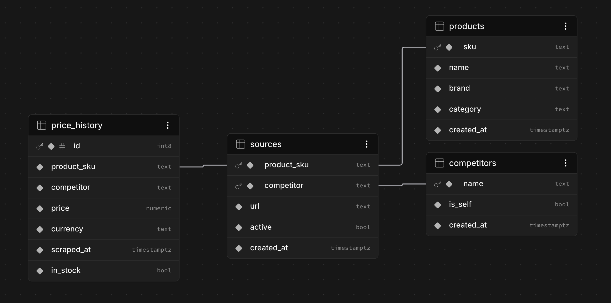

# Thiết kế Schema Cơ sở dữ liệu

Mô hình dữ liệu đứng sau PC Pricing Dashboard. Toàn bộ DDL nằm trong
[`supabase/schema.sql`](../supabase/schema.sql); tài liệu này giải thích *lý do vì sao*.

Bốn bảng gốc (base table) nuôi một chuỗi các **view** chỉ-đọc thực hiện toàn bộ công việc so sánh, để
dashboard chỉ cần hiển thị các dòng dữ liệu đã hoàn chỉnh. Postgres (Supabase).

---

## Nguyên tắc thiết kế: khoá tự nhiên (natural key) xuyên suốt

Schema sử dụng **khoá chính tự nhiên (natural primary key)**, không phải id đại diện (surrogate id):

- **`products`** được khoá theo `sku` — định danh laptop thật, duy nhất mà chúng ta dùng để so khớp.
  Hai listing có cùng SKU là cùng một chiếc máy, nên giá có thể so sánh tương ứng nhau. (Tên gọi
  *không* phải là khoá: "Dell 15" bao gồm nhiều cấu hình có giá chênh lệch nhau hàng triệu đồng —
  tên đầy đủ chỉ được lưu để hiển thị.)
- **`sources`** được khoá theo `(product_sku, competitor)` — một dòng *chính là* "listing của sảnwh
  phẩm này trên đối thủ này," nên cặp đó chính là định danh của nó.
- **`price_history`** tham chiếu đến khoá tổng hợp đó, nên mỗi dòng giá đều mang theo sản phẩm và
  đối thủ mà nó thuộc về.

Các khoá ngoại (foreign key) dùng `ON UPDATE CASCADE` (để việc sửa một SKU gõ sai hoặc đổi tên đối
thủ tự động lan truyền theo) và `ON DELETE CASCADE`.

> **Lưu ý vận hành:** vì có cascade, việc xoá một dòng trong `products` sẽ xoá luôn toàn bộ
> `sources` và `price_history` liên quan — không bao giờ `DELETE FROM products` hàng loạt. Để sửa
> một SKU sai, chỉ xoá đúng dòng đó, hoặc dùng `UPDATE`.

---

## Các bảng gốc

### `products` — danh mục sản phẩm
Một dòng cho mỗi SKU chúng ta theo dõi. Được nạp bởi scraper TNC (`brand_of()` gắn nhãn cho mỗi
dòng). `sku` là khoá so khớp; `name`, `brand`, `category` dùng để hiển thị/lọc.

### `competitors` — danh bạ cửa hàng
Một dòng cho mỗi cửa hàng chúng ta scrape, bao gồm cả chính chúng ta (`is_self = true` cho Thành
Nhân). Một cửa hàng vẫn tồn tại ở đây **ngay cả khi nó không bán bất kỳ laptop nào của chúng ta**,
để dashboard có thể LEFT JOIN và luôn hiển thị đủ 8 đối thủ — kể cả những đối thủ có danh mục mỏng
(GearVN, Memoryzone) chỉ khớp được ít sản phẩm.

### `sources` — nơi tìm giá của một sản phẩm trên một cửa hàng
Một dòng cho mỗi cặp `(product, competitor)`, chứa URL trang sản phẩm. `active` cho phép vô hiệu
hoá một nguồn mà không cần xoá nó.

### `price_history` — nhật ký giá chỉ-thêm (append-only)
Nguồn dữ liệu chuẩn (source of truth). **Không bao giờ được update** — mỗi lần scrape sẽ *chèn thêm*
một dòng mới, nên lịch sử tích luỹ dần để phân tích xu hướng. Mang theo `in_stock` (một đối thủ có
thể liệt kê giá nhưng lại hết hàng / "sắp có hàng" / liên hệ để biết giá; mặc định là `true`). Được
đánh index trên `(product_sku, competitor, scraped_at desc)` — đúng hình dạng mà `latest_prices`
cần.

---

## Chuỗi view

Mỗi view xây dựng dựa trên view trước đó, nên một quy tắc (như "một giá hiện tại cho mỗi cửa hàng")
chỉ cần áp dụng một lần và được kế thừa ở mọi nơi.

### `latest_prices` — một giá hiện tại cho mỗi cặp (sản phẩm, cửa hàng)
`DISTINCT ON (product_sku, competitor)` + `ORDER BY … scraped_at desc` gộp lịch sử chỉ-thêm
(append-only) thành đúng một dòng mới nhất cho mỗi cặp (model, cửa hàng). Đây chính là điều khiến
mọi view phía sau so sánh các giá *mới nhất*. Được join với `products` + `competitors` (và
left-join với `sources` để lấy URL). Index hỗ trợ cho phép Postgres thực hiện việc này chỉ bằng một
lần quét đã sắp xếp (ordered scan).

> "Mới nhất (Latest)" nghĩa là *được scrape gần đây nhất*, không phải *chắc chắn vẫn đang bán* — một
> model đã ngừng bán vẫn giữ giá cuối cùng ở đây. Bộ lọc `in_stock` trong `price_stats` xử lý trường
> hợp phổ biến đó.

### `price_stats` — thị trường (chỉ tính đối thủ), theo từng sản phẩm
Tổng hợp giá của đối thủ (`is_self = false`) theo từng SKU: `num_sources`, trung bình (mean), trung
vị (median), min, max. Giá của chính chúng ta bị loại trừ để các số liệu này phản ánh *bối cảnh cạnh
tranh* mà chúng ta sau đó so sánh với nó.

**Chỉ tính hàng còn bán** (`AND in_stock`): một listing hết hàng của đối thủ không phải là một giá
đang thực sự bán — các cửa hàng thường ngừng cập nhật những gì họ không bán được, nên một giá OOS đã
cũ sẽ khiến chúng ta trông như đang định giá sai so với một con số mà không ai có thể mua được. Một
sản phẩm mà đối thủ *duy nhất* của nó đang hết hàng sẽ có `num_sources = 0` → không có thị trường →
nó bị loại khỏi phép so sánh (đúng đắn: không có gì đang bán thật để so sánh).

### `price_comparison` — giá của chúng ta so với thị trường
Join giá của chính chúng ta (dòng `is_self`) với `price_stats`. `delta_vs_mean` / `pct_vs_mean`
dương khi chúng ta định giá **cao hơn** mức trung bình thị trường, âm khi thấp hơn. Dùng LEFT JOIN
để một sản phẩm không có đối thủ nào còn hàng vẫn cho ra một dòng (các cột thị trường là null).

### `product_overview` — một dòng hiển thị hoàn chỉnh cho mỗi sản phẩm
View chính mà dashboard đọc. Thực hiện pivot + so sánh trong SQL:
- **`prices_by_store`** — một mảng JSON chứa giá của từng cửa hàng, **sắp xếp rẻ nhất trước** ngay
  trong SQL (không sắp xếp phía client). Khi có giá bằng nhau, cửa hàng của chính chúng ta
  (`is_self`) được sắp lên trước, nên chúng ta thắng trong trường hợp hoà và được gắn nhãn "thấp
  nhất". Mỗi mục mang theo `store, price, is_self, url, in_stock`.
- **`cheapest_competitor`** — giá thị trường thấp nhất (không tính chúng ta).
- **`lowest_store` / `we_are_lowest`** — giá thấp nhất trong tất cả mọi người kể cả chúng ta (hoà →
  chúng ta thắng).
- **`our_price`** — lấy từ dòng `is_self` (có mặt cho mọi sản phẩm, kể cả sản phẩm không đối thủ
  nào bán, nên nó vẫn tồn tại qua LEFT JOIN với `price_comparison`).

Sắp xếp theo mức độ được so sánh nhiều nhất lên trước; các sản phẩm chỉ TNC bán (0 đối thủ) chìm
xuống cuối.

### `needs_attention` — "định giá cao hơn thị trường"
`product_overview` được lọc còn `pct_vs_mean > 5`, xấu nhất lên đầu, `limit 100` (giới hạn an toàn).
Cùng hình dạng dòng dữ liệu với `product_overview` để dashboard tái sử dụng cùng kiểu dữ liệu; nó
hiển thị 10 mục đầu tiên kèm nút chuyển đổi "xem tất cả".

### `competitor_coverage` / `competitor_coverage_all`
Có bao nhiêu trong số các laptop chúng ta theo dõi được mỗi đối thủ định giá.
- **`competitor_coverage`** là **theo từng thương hiệu**: nó `CROSS JOIN` danh bạ đối thủ với tập
  hợp các thương hiệu, để một cửa hàng không bán bất kỳ sản phẩm nào của một thương hiệu (ví dụ
  HACOM có 0 sản phẩm Lenovo) vẫn xuất hiện cho thương hiệu đó với `products_matched = 0`. Dashboard
  lọc view này bằng `.eq("brand", …)`.
- **`competitor_coverage_all`** là bản tổng hợp trên tất cả các thương hiệu (một dòng cho mỗi đối
  thủ), dùng cho chế độ xem "Tất cả thương hiệu".
</content>

### `price_activity` / `sku_price_trend_7d` — biến động giá theo thời gian
Hai view này KHÔNG đọc `latest_prices` (ảnh chụp lần scrape gần nhất) mà đọc thẳng lịch sử
`price_history`, để trả lời "giá thay đổi thế nào theo thời gian" thay vì "hiện ai rẻ nhất":
- **`price_activity`** — mỗi dòng là (cửa hàng × tuần): cửa hàng đó đổi giá bao nhiêu lần trên mỗi
  100 sản phẩm trong tuần. Chuẩn hoá theo độ phủ nên so sánh công bằng giữa cửa hàng lớn/nhỏ.
- **`sku_price_trend_7d`** — mỗi dòng là (sản phẩm × cửa hàng): 7 ngày qua đổi giá mấy lần, tăng hay
  giảm, net bao nhiêu %.

Cả hai đều loại quan sát lúc HẾT HÀNG (`price = 0` / `in_stock = false`) trước khi so sánh, vì
`0 → 24.990.000` là *có hàng trở lại*, không phải *tăng giá vô hạn*.

→ Giải thích chi tiết từng mệnh đề SQL (`lag`, `first_value`, `not exists`, `filter`, `having`):
xem [`price-trend-views.md`](price-trend-views.md).
